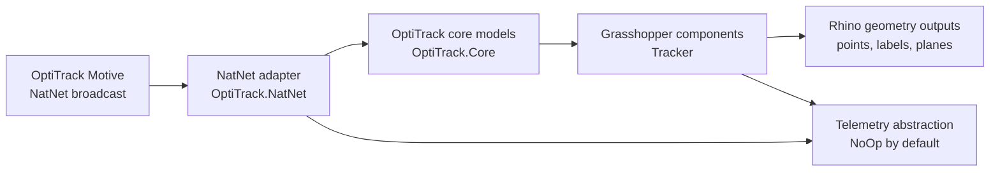

# Architecture

Tracker separates Grasshopper UI code from NatNet SDK-specific code so future NatNet upgrades, tests, and telemetry work can happen behind stable internal boundaries.

## Boundaries

`OptiTrack.NatNet` is the only layer that should reference `NatNetML` classes. It owns the NatNet client, data descriptors, frame event callback, and conversion into SDK-independent models.

`OptiTrack.Core` contains internal domain models and `IOptiTrackClient`. This layer does not know about Rhino, Grasshopper, or Sentry.

`TrackerComponent` consumes `IOptiTrackClient`, receives `OptiTrackFrame` instances, and converts them into Grasshopper outputs. Rhino geometry creation remains in the Grasshopper layer.

`OptiTrack.Telemetry` defines a future reporting boundary. The active implementation is `NoOpTelemetryService`, so telemetry calls are local no-ops unless a later release explicitly configures a transport.

## Privacy

The abstraction does not make motion-capture data safe for telemetry. Domain models can contain marker coordinates and rigid body names for local component outputs. Telemetry integrations must use `TelemetrySanitizer` and must avoid raw frame data, marker coordinates, rigid body names, file paths, IP addresses, usernames, machine names, and Rhino document names.
