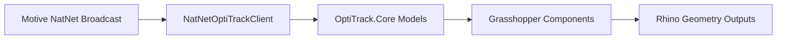
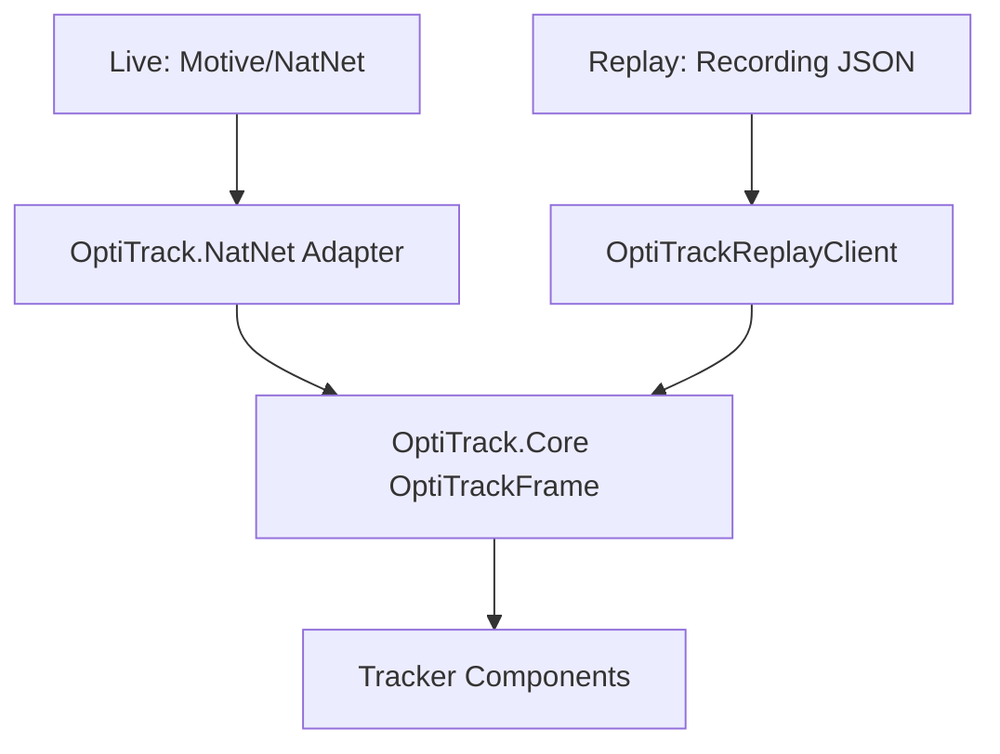

# Architecture

Tracker keeps NatNet SDK usage isolated and routes both live capture and replay through shared domain models.

## Motive to Grasshopper Data Flow

## Live vs Replay Paths

## Boundaries

- `OptiTrack.NatNet`: only layer with direct `NatNetML` usage.
- `OptiTrack.Recording`: recording schema, serializer, and replay adapter.
- `OptiTrack.Core`: transport-neutral models and `IOptiTrackClient`.
- `Tracker.Components` and `TrackerComponent`: Grasshopper UX and Rhino geometry conversion.
- `OptiTrack.Telemetry`: optional telemetry interface and sanitizer boundary.

## Why This Shape

- Live and replay both produce `OptiTrackFrame`, so downstream geometry/calibration chains stay reusable.
- NatNet upgrades are localized to one adapter.
- Telemetry implementation can change without changing component business logic.

## Privacy Boundary

Domain models include motion data for local computation. Telemetry must only receive sanitized aggregate metadata and must never include marker coordinates, rigid body names, raw frames, paths, IPs, usernames, or Rhino document identifiers.
