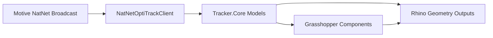
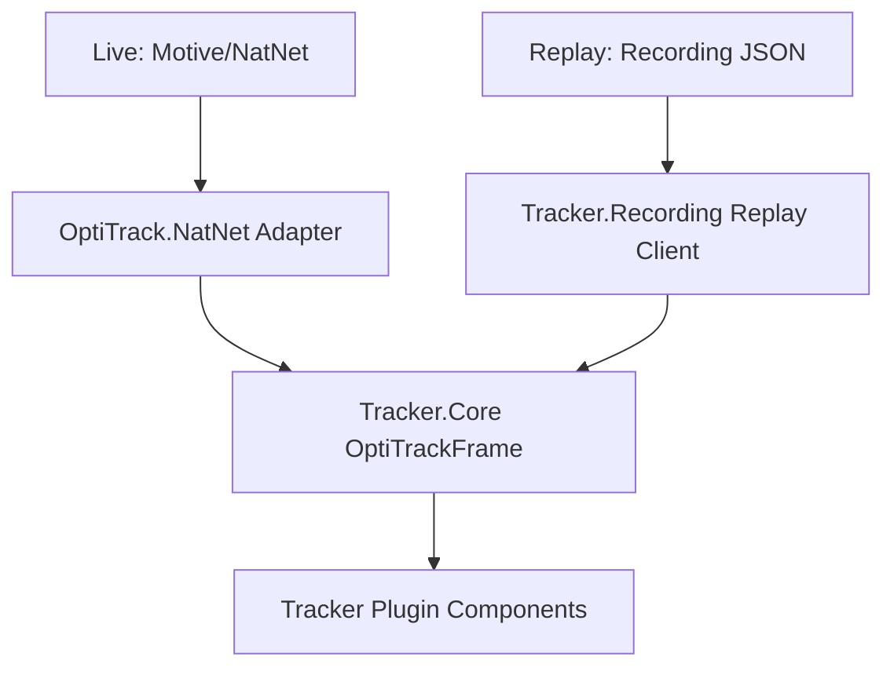

# Architecture

Tracker keeps NatNet SDK usage isolated and routes both live capture and replay through shared domain models. Runtime-neutral logic is extracted into dedicated libraries so tests do not have to load the Grasshopper plugin shell.

## Motive to Grasshopper Data Flow

## Live vs Replay Paths

## Boundaries

- `Tracker.Core`: transport-neutral models, `IOptiTrackClient`, buffering, and utilities.
- `Tracker.Recording`: recording schema, serializer, recording session, and replay adapter.
- `Tracker.Telemetry`: optional telemetry interface, sanitizer, scopes, and no-op implementation.
- `OptiTrack.NatNet`: only layer with direct `NatNetML` usage.
- `Tracker.Components` and `TrackerComponent`: Grasshopper UX, Rhino geometry conversion, and runtime wiring.
- `SentryTelemetryService` and `TelemetryServiceProvider` remain in the plugin shell because they depend on runtime-specific integration details.

## Why This Shape

- Live and replay both produce `OptiTrackFrame`, so downstream geometry/calibration chains stay reusable.
- NatNet upgrades are localized to one adapter.
- Telemetry implementation can change without changing component business logic.

## Privacy Boundary

Domain models include motion data for local computation. Telemetry must only receive sanitized aggregate metadata and must never include marker coordinates, rigid body names, raw frames, paths, IPs, usernames, or Rhino document identifiers.
