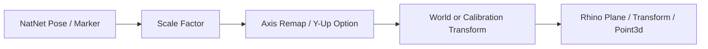

# Coordinate Systems

Tracker components assume NatNet positions are reported in meters in the Motive frame unless you explicitly apply a scale factor.

## Default Interpretation

- Position inputs from NatNet are interpreted as meters.
- `Scale Factor` converts positions/planes into your working unit space.
  Example: use `1000.0` when you want millimetre-scale outputs from meter-scale input.
- Quaternion inputs are interpreted as `W, X, Y, Z`.

## Axis Handling

`OptiTrackGeometryConverter` supports axis remapping:

- `None`: keep incoming axes unchanged before legacy rotation handling.
- `ZUpToYUp`: remap points from Z-up to Y-up.

`Y Up` options in components apply the existing stream-oriented Y-up adjustment used by the live capture component.

## World and Calibration Transforms

- Use `Calibrate OptiTrack Frame` to compute source-to-target frame transforms.
- Use `Apply OptiTrack Transform` to map geometry into a world, robot, or fixture frame.
- Keep calibration transforms explicit in the graph so downstream robotics logic can be audited.

## Coordinate Transform Chain

## Unit Safety Checklist

1. Confirm Motive export unit assumptions (usually meters in NatNet streams).
2. Set scale once near the conversion stage.
3. Avoid mixing scaled and unscaled streams in the same branch.
4. Document scale conventions in Grasshopper groups for collaborators.
