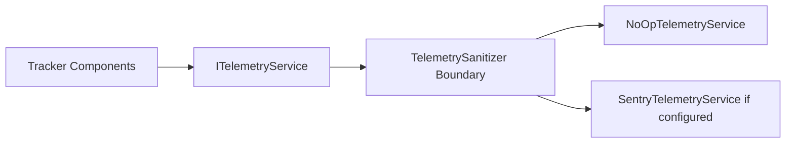

# Optional Sentry Setup

Sentry is optional in Tracker and is disabled by default.

## 1. Create a Sentry Project (Outside This Repository)

1. Sign in to Sentry.
2. Create a .NET project in your own Sentry org/workspace.
3. Copy the DSN from Sentry project settings.
4. Keep DSN private and out of source control.

## 2. Provide Configuration Without Committing Secrets

Use one of:

- Environment variables
- Local `tracker.telemetry.local.json` next to `Tracker.gha` (git-ignored)

Supported keys:

- `SENTRY_DSN`
- `SENTRY_ENVIRONMENT`
- `SENTRY_RELEASE`
- `SENTRY_TRACES_SAMPLE_RATE`

Example local file:

```json
{
  "SENTRY_DSN": "",
  "SENTRY_ENVIRONMENT": "local",
  "SENTRY_RELEASE": "tracker@1.7.0",
  "SENTRY_TRACES_SAMPLE_RATE": "0"
}
```

## 3. Enable or Disable in Grasshopper

- Enable: set component `Enable Telemetry = true` and provide valid config.
- Disable: set `Enable Telemetry = false` or remove/clear `SENTRY_DSN`.

## 4. Safe Sentry Data Policy

Never send:

- marker coordinates
- rigid body names
- raw frame payloads
- file paths or user-selected filenames
- IP addresses
- usernames, machine names, project/model identifiers

## 5. Telemetry Flow and Redaction Boundary



## 6. Safe Error Reporting Test

1. Use replay components with sample data.
2. Enable telemetry.
3. Trigger a controlled config error (for example invalid replay file format).
4. Confirm Sentry receives only high-level error type and operation tags.

## 7. Safe Performance Monitoring Test

1. Enable telemetry with low sample rate (for example `0` to `0.05`).
2. Run replay or conversion operations.
3. Verify events contain aggregate duration/count metrics only.
4. Confirm no geometry payload fields are present.
